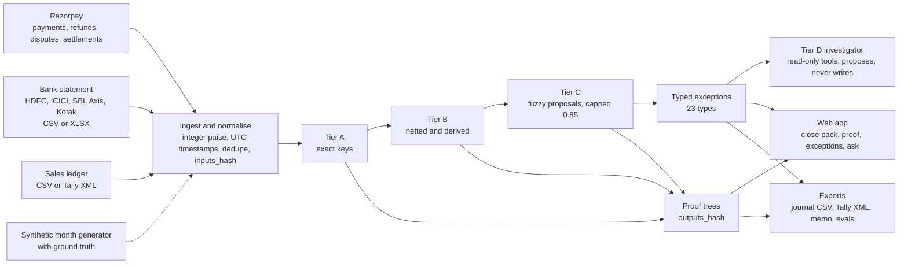
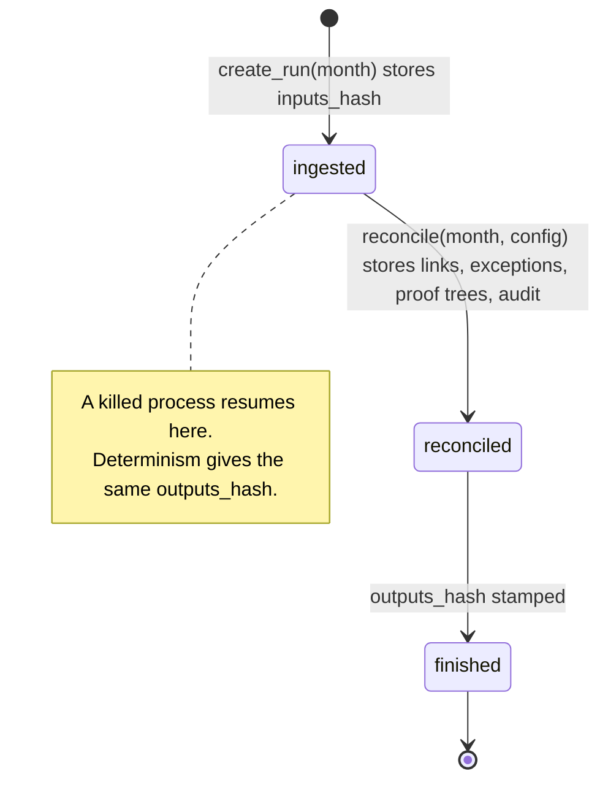

# Barabar

**AI Finance Controller for Razorpay merchants. Razorpay AI Buildathon 2026, Track 04.**

A Razorpay payout is one bank credit hiding hundreds of orders, fees, 18% GST on fees, refunds and chargebacks. Barabar reconciles **settlements, bank statement and sales ledger** to the paise, explains every unmatched rupee with a typed exception, drafts the journal entries, and answers the question every founder asks at month end:

> "I sold ₹2,10,000 this week. Why did ₹1,83,412 land in my bank?"

To the paise, with a proof tree, and the rule that produced every link.

**Deterministic where money is decided. AI only on the tail.** No language model has ever decided a match in this system.

*Barabar* (बराबर) means "exactly equal". When the residual is ₹0.00, the books are barabar.

| | |
|---|---|
| Live product | https://barabar-xi.vercel.app |
| Explainer for newcomers | https://barabar-xi.vercel.app/app/guide |
| API and OpenAPI docs | https://barabar-api.vercel.app/docs |
| Evals report | [`evals/reports/latest.md`](evals/reports/latest.md) |
| What broke | [`docs/FAILURES.md`](docs/FAILURES.md) |

## Headline numbers

Regenerate with `make evals`. Every figure is scored against generator ground truth, never against the matcher's own opinion of itself.

| Month | Auto-match | Precision, tiers A/B | Exception classification | Explained | Coverage of the explainable | Wall clock |
|---|---:|---:|---:|---:|---:|---:|
| 60 orders | 100.0% | 100% | 100% | 74.4% | 100% | 0.005 s |
| 600 orders (the demo) | 99.94% | 100% | 100% | 92.5% | 100% | 0.03 s |
| 6,000 orders | 99.99% | 100% | 100% | 97.0% | 100% | 0.55 s |
| 60,000 orders | | | | | | 5.4 s (target under 90 s) |

False-match cost at tiers A/B: **₹0 at every size.** Investigator hypothesis accuracy on the demo month: **24 of 24.** Determinism: three runs, one hash. Prompt-injection state changes: 0.

"Explained" is honest. The demo month deliberately injects a missing bank credit, an unknown credit, a truncated UTR and two manual adjustments: rupees no rule can explain without a person. "Coverage" is how much of everything else the rules explained.

## 60-second quickstart

```bash
git clone https://github.com/Adwaitbytes/barabar && cd barabar
make install            # uv venv + Python deps, pnpm install in web/
make demo               # reconcile a 600-order synthetic month; prints the four hashes and the close pack
make evals              # regenerate evals/reports/<date>.md for 60 / 600 / 6,000 orders
make api                # FastAPI on :8000
cd web && BARABAR_API_URL=http://localhost:8000 pnpm dev    # web app on :3000
```

`make demo` prints `inputs_hash`, `config_hash`, `code_version` and `outputs_hash` before any match rate. Same inputs and config, same hash, every time.

Optional: `cp .env.example .env` and add a **test-mode** Razorpay key (the code refuses live keys) and an Anthropic-compatible key for the investigator. `make seed` creates test-mode orders and payment links; `barabar fetch --year 2026 --month 9 --out evals/datasets/testmode` pulls them back.

## What it does

1. **Ingest** Razorpay entities (API, webhooks, or `/settlements/recon` JSON), the bank statement (HDFC, ICICI, SBI, Axis, Kotak; CSV or XLSX; layout auto-detected), and the sales ledger (CSV in a documented schema, or a Tally Day Book XML export).
2. **Match** with three deterministic tiers. Tier A: exact keys (UTR, settlement id, payment id, receipt). Tier B: derived facts (batch net equals bank credit, gross minus fee minus GST decomposition, refund netting, split UTRs, partial continuation, calendar reshift, failed-and-retried chains). Tier C: fuzzy proposals capped at 0.85 confidence that a person accepts.
3. **Explain** every residual with one of 23 typed exceptions ([`docs/EXCEPTIONS.md`](docs/EXCEPTIONS.md)), each carrying the rule that produced it, a confidence and a suggested action.
4. **Prove** with a proof tree per bank credit: bank credit, settlement, lines (gross, fee, GST), refunds, chargebacks, adjustments, every node tagged with its rule id.
5. **Investigate** the tail. A tier-D agent reads through read-only tools, proposes a hypothesis with hashed evidence, names the alternative it rejected. It cannot write. NumberGuard blocks any figure it did not get from a tool, including "helpful" rounding.
6. **Close.** Journal vouchers (CSV and Tally Prime XML), a controller's memo, the GST-on-fees input-credit figure, an exceptions CSV, an HTML close pack, and a hash-chained audit trail.

## Architecture



### Run lifecycle



A run is `(inputs_hash, config_hash, code_version) -> outputs_hash`. The CLI refuses to print a match rate without printing all four.

### One settlement, one proof

```
Bank credit  ₹1,83,412.00  HDFC  14-Aug-2026  UTR HDFCN26226004471           [A1-UTR-EXACT]
└─ Settlement setl_Q1x...  net ₹1,83,412.00  processed 14-Aug 06:12          [B1-BATCH-NET, residual ₹0]
   ├─ 287 payments  gross ₹2,10,000.00  fee ₹3,420.00  GST ₹615.60          [B2-GROSS-FEE-TAX-DECOMP]
   ├─ 6 refunds     -₹18,452.40                                             [B3-REFUND-NET]
   ├─ 1 dispute     -₹4,200.00  opened 09-Aug, respond by 23-Aug            [DISPUTE_DEBIT]
   ├─ 1 adjustment  +₹100.00  manual credit                                 [ADJUSTMENT]
   └─ Σ = ₹1,83,412.00
```

### Packages

| Package | Depends on | Holds |
|---|---|---|
| `core` | nothing inside barabar | money, calendar, rate card, UTR and narration grammar, models, exception taxonomy, matcher tiers A/B/C, proof trees, hashing, audit chain |
| `simulator` | core | Razorpay settlement rules applied to entities; settlements, recon lines, bank statement, ground truth |
| `generator` | core, simulator | merchant profiles, fault plan, a believable month with every exception type injected |
| `adapters` | core | bank CSV/XLSX per layout, ledger CSV, Tally Day Book XML, Razorpay JSON, Razorpay API and seed |
| `exports` | core | journal vouchers, Tally XML, controller's memo |
| `agent` | core | tool belt, investigator, ask-the-books, NumberGuard, narration fallback |
| `evals` | all of the above | datasets, scorer, reports, investigator evals |
| `api` | all of the above | SQLAlchemy store, FastAPI routes, webhook verification |

`import-linter` enforces the arrows. `core` imports nothing else in the package.

## Where the AI is, and where it is not

| Task | Deterministic code | LLM |
|---|---|---|
| Deciding two records match | always | never |
| Fee, tax and net arithmetic; calendar shifting; cut-offs | always | never |
| Parsing bank narration in known layouts | grammar per bank | unknown layouts only, re-validated by the grammar |
| Classifying an exception into one of 23 types | always | never |
| Investigating an open exception | | read-only tools, no writes, a person accepts |
| Explaining a proof tree in words; drafting the memo | the facts | the prose, every number guarded |

Three rules make it read senior. Money math is deterministic and tested. The LLM works the tail and never mutates a match. Every run is replayable.

## Simulated vs real

Test mode gives real payments, refunds, disputes and webhooks. It does not reliably generate settlements. Barabar ships a Settlement Simulator that applies Razorpay's documented rules (T+2 working days, RBI 2026 holidays, per-method MDR plus 18% GST, refund and dispute netting, partial, split and failed batches, per-bank narration layouts and truncation) and says so: [`docs/SIMULATED-VS-REAL.md`](docs/SIMULATED-VS-REAL.md). With a live key that has settlements, `/v1/settlements/recon` is read and the simulator is bypassed.

## Tax facts we get right (verified September 2026)

GST on gateway fees is 18% on the fee, claimable as input tax credit against Razorpay's monthly tax invoice. Section 194-O TDS is 0.1% since 1 October 2024 and is deducted by marketplaces, not payment gateways. GST TCS is 0.5% since 10 July 2024, collected by marketplaces. A D2C merchant on Razorpay sees neither on a settlement.

## Non-goals in v1

Barabar does not move money: no refund, payout or capture is ever initiated. It does not forecast cash. It does not contest disputes; it surfaces them with evidence. There is no live bank connectivity; Account Aggregator is documented, not built.

## Repo map

```
src/barabar/core        money, calendar, rate card, UTR and narration grammar, models, matcher, proof trees, audit chain
src/barabar/simulator   Razorpay settlement rules to settlements, recon lines, bank statement, ground truth
src/barabar/generator   merchant profiles and fault plan to a believable month
src/barabar/adapters    bank CSV/XLSX per layout, ledger CSV, Tally XML, Razorpay JSON, Razorpay API and seed
src/barabar/exports     journal vouchers, Tally XML, controller's memo
src/barabar/agent       tool belt, investigator, ask-the-books, NumberGuard, narration fallback
src/barabar/evals       datasets, scorer, reports
src/barabar/api         SQLAlchemy store, FastAPI, webhook verification
web/                    Next.js app: landing, close pack, settlements, proof viewer, exceptions, ask, journal, runs, guide
tests/                  unit, property (hypothesis), golden, idempotency, agent (fake client)
docs/                   ARCHITECTURE, DATA-MODEL, EXCEPTIONS, SIMULATED-VS-REAL, DECISIONS, FAILURES, PRIVACY, PITCH, APPLICATION
evals/reports           committed, regenerable
```

## Quality gates

`make lint` runs ruff, the import-boundary contracts and a house-style check. `make typecheck` runs pyright in strict mode. `make test` runs 171 tests including property-based tests over random months (no-fault months must reconcile with zero false links; rupees are conserved; every exception type must appear in the 600-order set). CI runs all of it plus a strict evals smoke on every push.

## What broke

[`docs/FAILURES.md`](docs/FAILURES.md) has ten real entries in the shape *what we saw, what we believed, what was true, what changed*. The one we read first: our own ground truth called a correct RTGS match wrong, because the truth came from a flag instead of from data.

## License

MIT.
