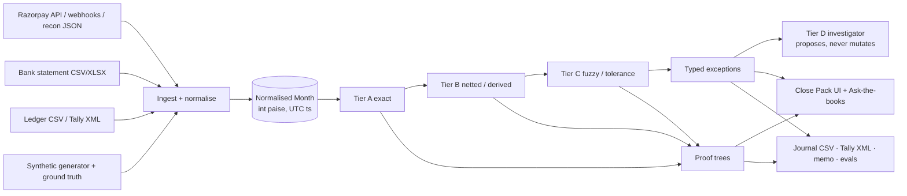

# Architecture

Barabar is a finance-controller agent for Razorpay merchants. Money decisions are deterministic code; the LLM investigates the tail and drafts prose.

## Packages (`src/barabar/`)

| Package | Depends on | Holds |
|---|---|---|
| `core` | nothing inside barabar | money, calendar, rate card, UTR grammar, narration grammar, models, exception taxonomy, matcher tiers A/B/C, proof trees, hashing, audit chain |
| `simulator` | core | settlement rules → settlements, recon lines, bank statement; ground truth |
| `generator` | core, simulator | merchant profiles, fault plan, a believable month |
| `adapters` | core | bank CSV/XLSX per layout, ledger CSV, Razorpay JSON, Razorpay API/seed |
| `exports` | core | journal vouchers, Tally XML, controller memo |
| `agent` | core | investigator tool belt, hypothesis cards, NumberGuard, Ask-the-books |
| `evals` | all of the above | datasets, scorer, reports |
| `api` | all of the above | store (SQLAlchemy), FastAPI routes, webhook verification |

`import-linter` enforces the arrows (see `pyproject.toml`).

## Run lifecycle

```mermaid
stateDiagram-v2
  [*] --> ingested: create_run(month), inputs_hash stored
  ingested --> reconciled: reconcile(month, config), result + audit stored
  reconciled --> finished: outputs_hash stamped
  finished --> [*]
  note right of ingested: a killed process resumes here;\ndeterminism gives the same outputs_hash
```

A run is `(inputs_hash, config_hash, code_version) → outputs_hash`. The CLI refuses to print a match rate without printing all four.

## Matcher pipeline

1. Normalise and dedupe (Razorpay ids; bank `utr_full`; ledger `(invoice_no, gross, date)`).
2. **Tier A** exact keys: `A1-UTR-EXACT`, `A2-SETTLEMENT-ID-IN-NARRATION`, `A3-PAYMENT-ID-LEDGER`, `A4-RECEIPT-LEDGER`.
3. **Tier B** derived: `B1-BATCH-NET`, `B2-GROSS-FEE-TAX-DECOMP`, `B3-REFUND-NET`, `B4-MULTI-UTR-SPLIT`, `B5-PARTIAL-CONTINUATION`, `B6-CALENDAR-RESHIFT`, `B7-FAILED-RETRY-CHAIN`.
4. **Tier C** proposals, capped at 0.85: `C1-UTR-PREFIX`, `C2-AMOUNT-DATE-NARRATION`, `C3-LEDGER-FUZZY`. Below `auto_accept_threshold` (0.92) they become exceptions with a candidate link.
5. Classify residuals into the 23 v1 exception types; build proof trees; compute metrics; hash.
6. **Tier D** on demand: the investigator reads through tools, cites evidence, proposes a type and action, names the alternative it rejected. Acceptance is a human click that creates a `D-accepted` link.

## The LLM boundary

| Task | Deterministic code | LLM |
|---|---|---|
| Deciding two records match | ✅ | ❌ |
| Fee / tax / net arithmetic | ✅ | ❌ |
| Calendar shifting, cut-offs | ✅ | ❌ |
| Parsing bank narration (known layouts) | ✅ grammar per bank | fallback on unknown layouts, re-validated by the grammar |
| Classifying an exception type | ✅ | ❌ |
| Investigating an open exception | ❌ | ✅ tools, no writes |
| Explaining a proof tree in words | ❌ | ✅ |
| Drafting journal entries | ✅ templates | ✅ narration text only |
| Month-end memo | ✅ facts | ✅ prose, every number guarded |

No LLM has ever decided a match in this system.
